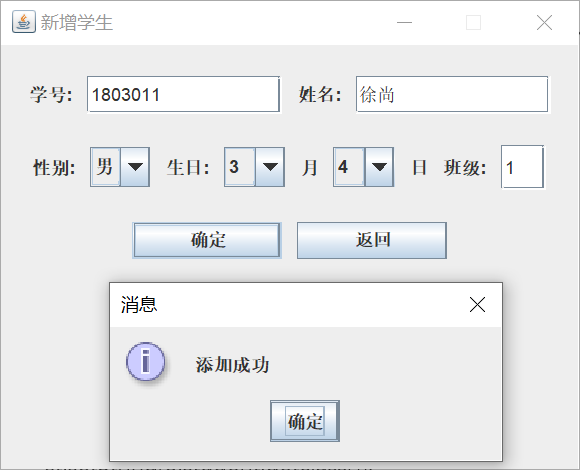
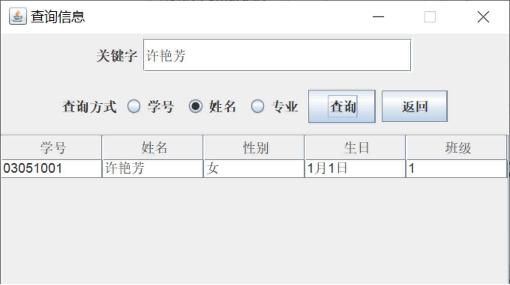
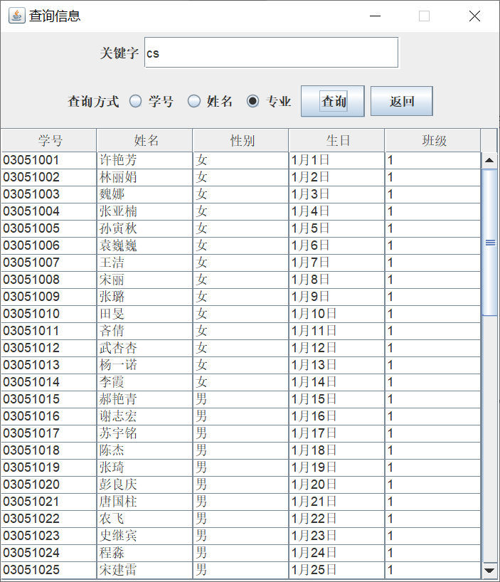
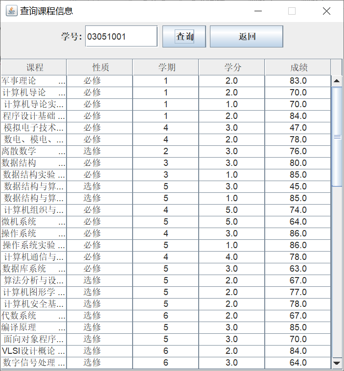
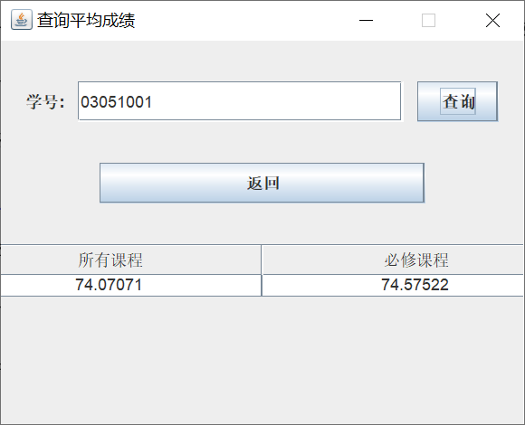
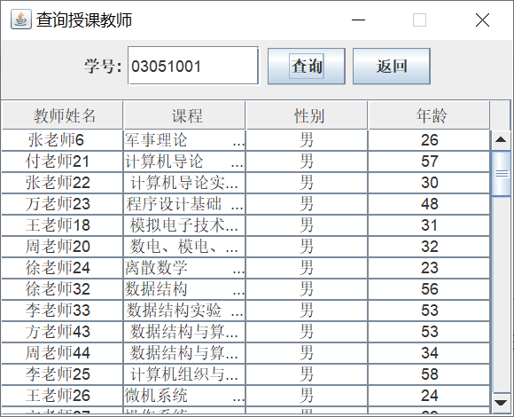
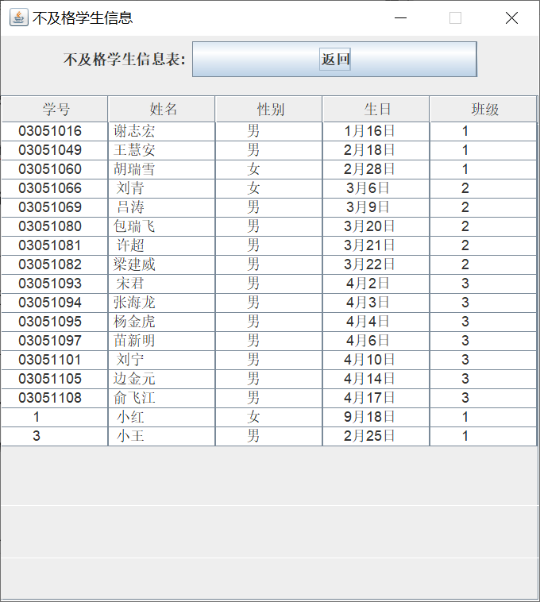

# XJGL
学生学籍管理系统，数据库课程大作业

## 项目简介
这是一个基于Java开发的学生学籍管理系统，用于管理学生、教师、课程、成绩和教学计划等信息。

## 环境要求
- JDK 8 或更高版本
- MySQL 5.7 或更高版本
- 项目依赖：mysql-connector-j-8.3.0.jar

## 数据库配置
1. 首先创建数据库：
```sql
CREATE DATABASE IF NOT EXISTS EXP;
USE EXP;
```
2. 运行项目根目录下的`数据库表创建语句.sql`文件来创建所需的表结构

## 编译命令
在项目根目录下执行以下命令编译项目：
```bash
javac -cp lib/mysql-connector-j-8.3.0.jar:src -d out/production/XJGL src/main/*.java
```

## 数据导入命令
在项目根目录下执行以下命令导入系统数据：
```bash
java -cp lib/mysql-connector-j-8.3.0.jar:out/production/XJGL main.DataImport
```

## 运行系统
在项目根目录下执行以下命令启动系统：
```bash
java -cp lib/mysql-connector-j-8.3.0.jar:out/production/XJGL main.start
```

## 数据导入说明
- 数据导入程序会自动清空所有表的数据并重新导入
- 导入的数据包括：班级专业、学生、教师、课程、学生课程成绩和教学计划信息
- 系统会自动忽略重复的记录
- 注意：数据文件需要放在`data/`目录下

## 常见问题
1. 中文乱码问题：系统已处理文件读取编码为GBK，确保中文能正常显示
2. 数据库连接问题：请检查`connectSQL.java`中的数据库连接配置

## Preview









